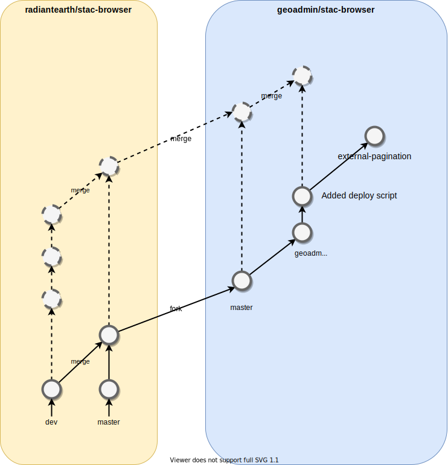

# STAC Browser for geo.admin.ch

This is a fork from [radiantearth/stac-browser](https://github.com/radiantearth/stac-browser) containing some
specific scripts and feature to deploy the STAC browser on [data.geo.admin.ch/browser/](https://data.geo.admin.ch/browser/).

- [GIT Branch Strategy](#git-branch-strategy)
- [Deploy](#deploy)

## GIT Branch Strategy

In order to simplify the merge from the upstream (`radiantearth/stac-browser`), we are not allowed to do any changes directly into the `master` branch,
this branch SHOULD ONLY contained changes from the upstream master branch.

Any geoadmin changes should be done in `geoadmin_master` branch (via PR from feature branch). This branch follows the general geoadmin GIT FLOW rules.

To get the lastest changes from the radiantearth, we first merge radiantearth master branch into our master branch and
then merge our master branch into `geoadmin_master`. This way conflict are resolved locally between two branch of the same repo. *NOTE: we should first thoughtfully test any upstream changes !*



NOTE: the `external-pagination` branch was an experiment to try to implement pagination on v2. However this implementation did not worked correctly and we went for the alpha v3, see below.

NOTE: Currently we have deployed the `v3` branch of `radiantearth/stac-browser` that is still in alpha state. We use the same branch schema as above simply replacing `master` by `v3`, respectively `origin/v3` which should be equal to `upstream/v3` and `origin/geoadmin_v3` which is based on `origin/v3` and contained our changes.

## Deploy

The STAC Browser is deployed on Amazon S3 using the following script

```bash
./geoadmin/deploy.sh --staging dev
```

You can also enter `./geoadmin/deploy.sh --help` to see other script options.

NOTE: You require to have your aws cli properly configured to run this script.
