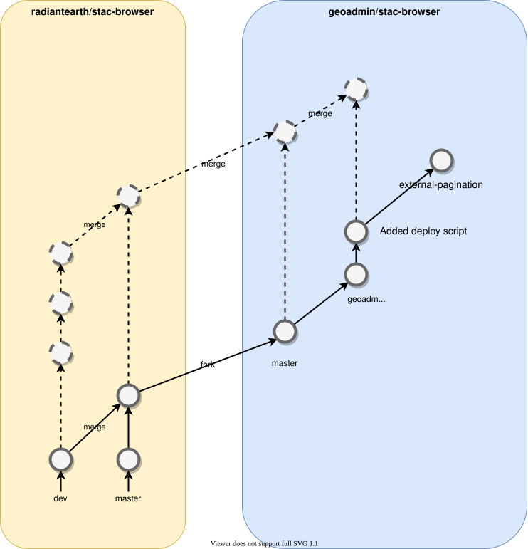

# STAC Browser for geo.admin.ch

This is a fork from [radiantearth/stac-browser](https://github.com/radiantearth/stac-browser) containing some
specific scripts and feature to deploy the STAC browser on [data.geo.admin.ch/browser/](https://data.geo.admin.ch/browser/).

- [GIT Branch Strategy](#git-branch-strategy)
- [Step-by-step upgrade to the latest upstream release](#step-by-step-upgrade-to-the-latest-upstream-release)
- [Deploy](#deploy)

## GIT Branch Strategy

In order to simplify the merge from the upstream (`radiantearth/stac-browser`), we are not allowed to do any changes directly into the `main` branch,
this branch SHOULD ONLY contain changes from the upstream master branch.

Any geoadmin changes should be done in `geoadmin_master` branch (via PR from feature branch). This branch follows the general geoadmin GIT FLOW rules.

As much as possible, changes should be contained within the `geoadmin/`
directory as to reduce the risk of conflicts when merging new upstream versions.

To get the lastest changes from the radiantearth, we first merge radiantearth main branch into our main branch and
then merge our main branch into `geoadmin_master`. This way conflict are resolved locally between two branch of the same repo. *NOTE: we should first thoughtfully test any upstream changes !*



### Step-by-step upgrade to the latest upstream release

This section explains how to import the latest upstream release.

1. [Sync](https://docs.github.com/en/pull-requests/how-tos/work-with-forks/syncing-a-fork#syncing-a-fork-branch-from-the-web-ui) the `main` branch to upstream.

2. Identify the [tag of the upstream release](https://github.com/radiantearth/stac-browser/tags) that you want to upgrade to. For example `v5.1.0`.

3. Verify your git clone has the upstream remote. For example:
```
git remove -v
origin  git@github.com:geoadmin/stac-browser.git (fetch)
origin  git@github.com:geoadmin/stac-browser.git (push)
upstream        git@github.com:radiantearth/stac-browser.git (fetch)
upstream        git@github.com:radiantearth/stac-browser.git (push)
```
The lines starting with `upstream` indicate you are able to fetch the upstream
changes from within your clone. If they are missing, you want to run something
like `git remote add upstream https://github.com/radiantearth/stac-browser.git`.

4. Fetch the upstream tags with `git fetch --tags upstream`.

5. Create a new branch based off `geoadmin_master`. For example:
```
git branch new-upstream-release geoadmin_master
```

6. Merge the desired version/tag into your new branch. For example:
```
git checkout new-upstream-release
git merge v5.0.1
```
No conflict should arise. If it does, you need to figure out how to resolve it
before proceeding.

7. Review the [release notes](https://github.com/radiantearth/stac-browser/releases/)
   and perform any necessary change in your branch.

8. Verify manually that everything works as intended. You can start a local web
   server with the version in your branch with something like this:
```
SB_CONFIG=geoadmin/config.js npm start
```
You can override the STAC instance defined in `geoadmin/config.js` by setting
the `SB_catalogUrl` environment variable. For example, if you want to test
against INT you can run something like this:
```
SB_CONFIG=geoadmin/config.js SB_catalogUrl=https://sys-data.int.bgdi.ch/api/stac/v1/ npm start
```

9. Push your branch and prepare a PR. For example:
```
git push origin new-upstream-release
```
Notice that by default GitHub will offer to create a PR to merge your change to upstream. You
do not want to do that. You want the PR to merge into `geoadmin_master`. For
example: `https://github.com/geoadmin/stac-browser/compare/geoadmin_master...new-upstream-release?expand=1`

10. Get the PR approved.

11. [Deploy](#deploy).

12. Merge the PR into `geoadmin_master`.

## Deploy

The STAC Browser is deployed on Amazon S3 using the following script

```bash
./geoadmin/deploy.sh --staging dev
```

You can also enter `./geoadmin/deploy.sh --help` to see other script options.

NOTE: You require to have your aws cli properly configured to run this script.

NOTE: This deploy script will immediately delete the old files. Depending on
      what clients have cached when, this may break users for up to the duration
      of the cache deadline (1h at the time of this writing).
